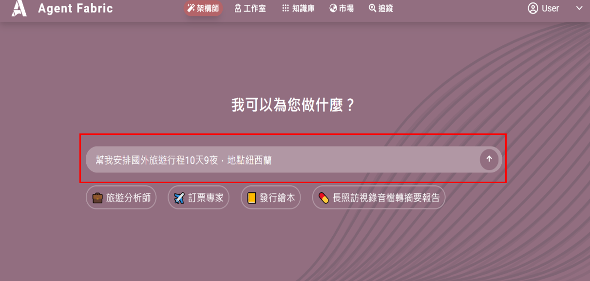
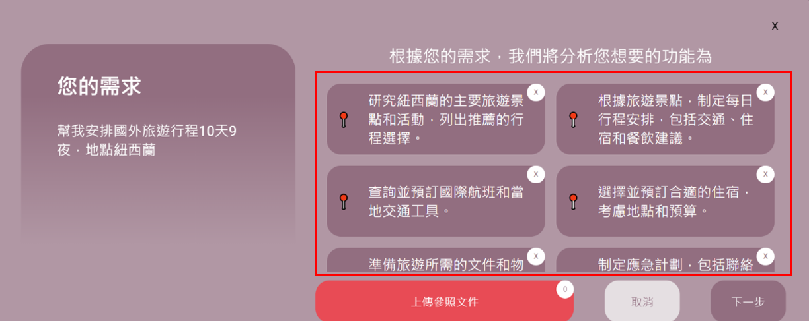
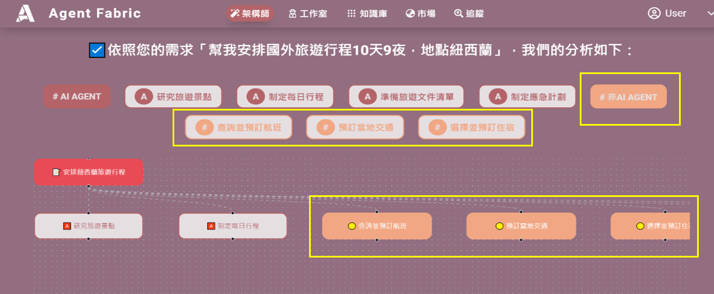

## 架構師使用說明

**影片範例**
<!-- <video width="1280"
height="696" controls>
      <source
src="./images/agentfabric_create_plan.gif"
type="video/mp4">
</video> -->

### 1.點選初始介面
在初始介面（圖1）中，點選「架構師」。

---

### 2.查詢資料
在查詢介面（圖2）中，輸入想要分析的資料，並按箭頭執行。

---

### 3.挑選分析內容
在挑選內容介面（圖3），選擇想要分析的內容，然後點擊「下一步」。
> **提示**：此步驟可讓分析內容更精確。

---

### 4.查看分析結果
在執行結果介面（圖4），橘色框顯示的是無法由 AI AGENT 執行的結果。

