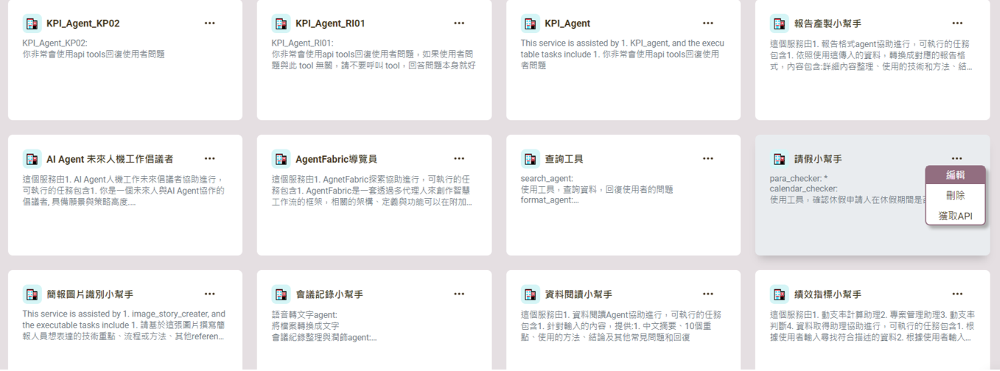
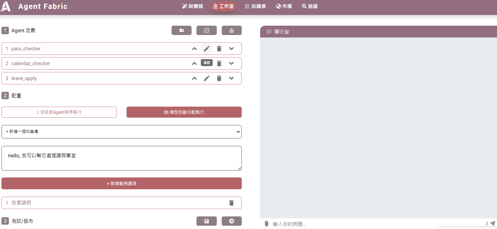
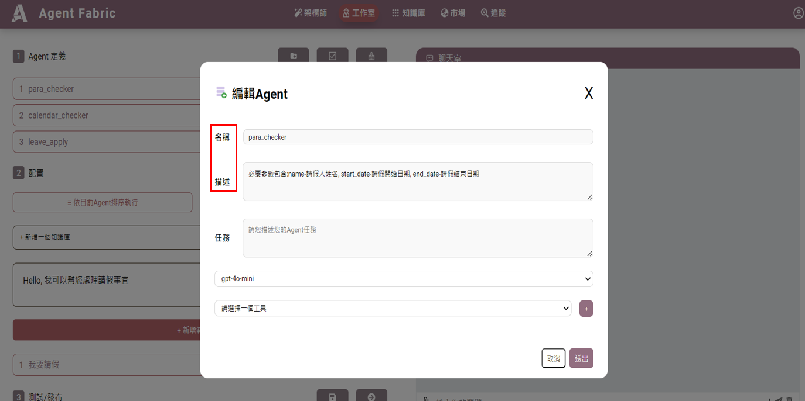
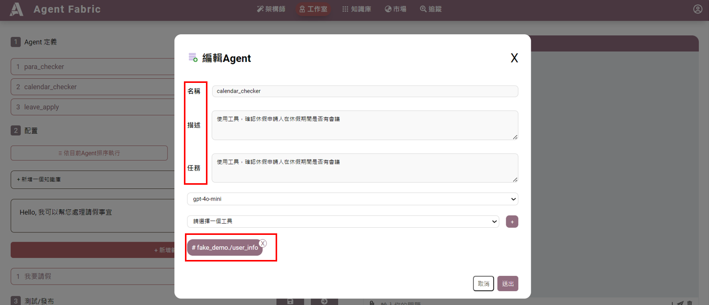
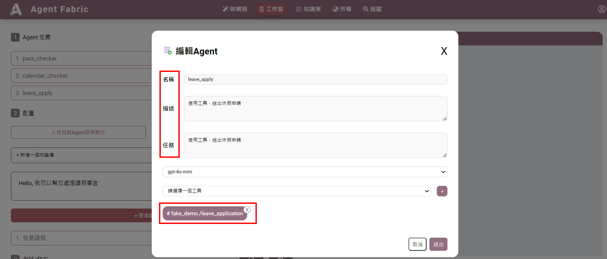
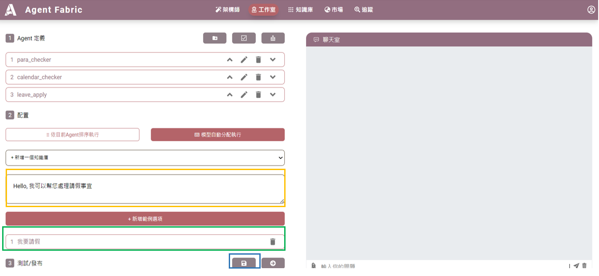
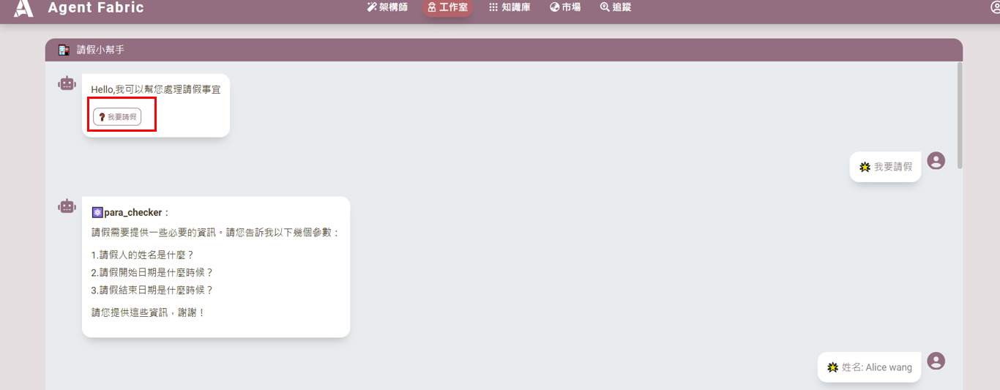
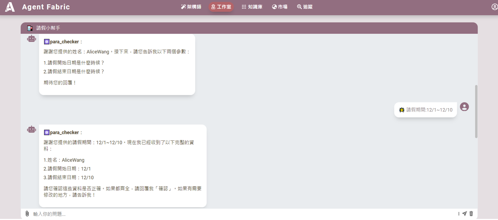
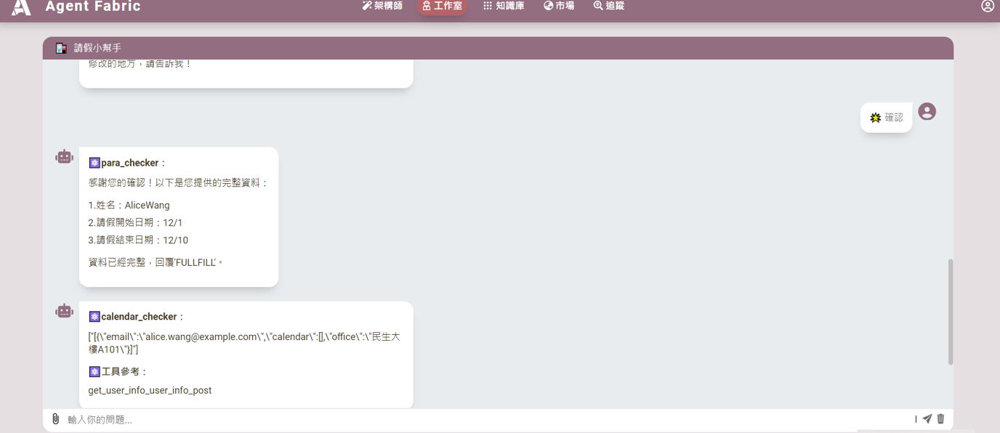

# 請假小幫手
---
**在現代工作和學習環境中，請假流程的簡化對於提高效率至關重要。以下是針對請假小幫手的設計，該系統可應用於學校和公司，並由三個主要代理（agents）組成，以便快速且簡單地處理請假申請。第一個 para_checker agent，功能是讓使用者填入必要參數，包含:name-請假人姓名, start_date-請假開始日期, end_date-請假結束日期。第二個 calendar_checker agent ，確認請假者是否在當期有會議。第三個 leave_apply agent ，使用工具，送出休假申請。**
---

## 步驟指南

### 1. 點選編輯

### 2. 點選標題 1 筆刷

### 3. 編輯第一個 `para_checker` agent 的名稱和描述
- **範例**：
  - 名稱：`para_checker`
  - 描述：必要參數包含：
    - `name` - 請假人姓名
    - `start_date` - 請假開始日期
    - `end_date` - 請假結束日期
  - 按送出。

---

### 4. 編輯第二個 `calendar_checker` agent 的名稱、描述、任務、選擇工具
- **範例**：
  - 名稱：`calendar_checker`
  - 描述：使用工具，確認休假申請人在休假期間是否有會議。
  - 任務：使用工具，確認休假申請人在休假期間是否有會議。
  - 選擇工具：`# fake_demo./user_info`
  - 按送出。

---

### 5. 編輯第三個 `leave_apply` agent 的名稱、描述、任務、選擇工具
- **範例**：
  - 名稱：`leave_apply`
  - 描述：使用工具，送出休假申請。
  - 任務：使用工具，送出休假申請。
  - 選擇工具：`# fake_demo./leave_application`
  - 按送出。

---

### 6. 自訂範例
- **橘框**：預設開場白。
- **綠框**：新增範例選項。
- 按藍框的「儲存」。

---

## 成果展示

### 7. 點選工作室的「請假小幫手」
進入畫面後點選紅框進行請假，並輸入以下資訊：
- 姓名：Alice Wang

### 8. 輸入請假期間
- 範例：12/1~12/10

### 9. 輸入「確認」
- 完成請假程序。
