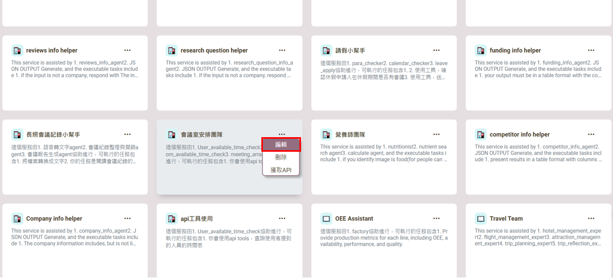
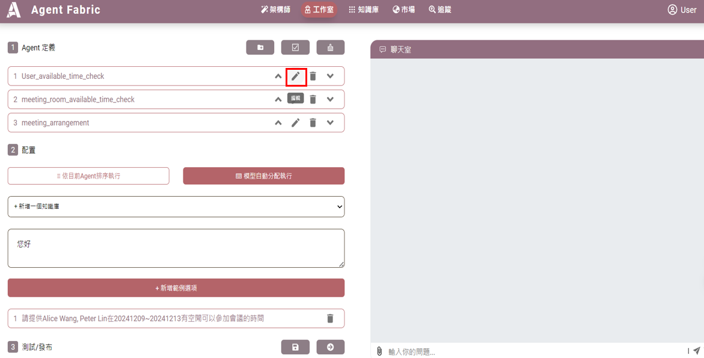
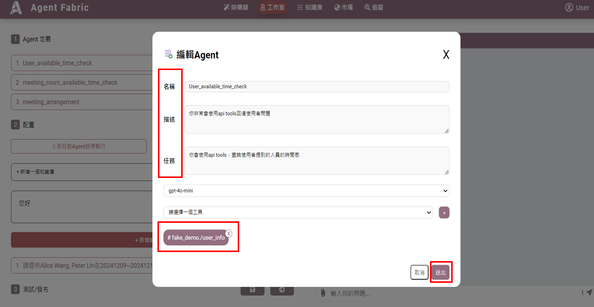
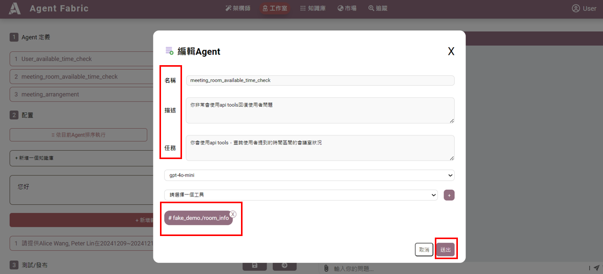
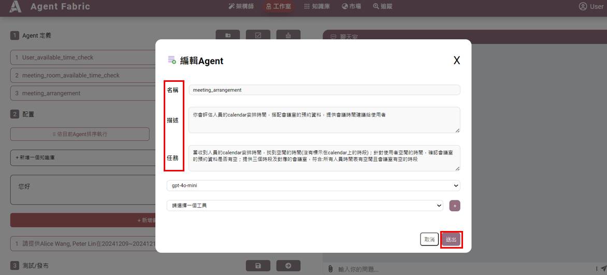
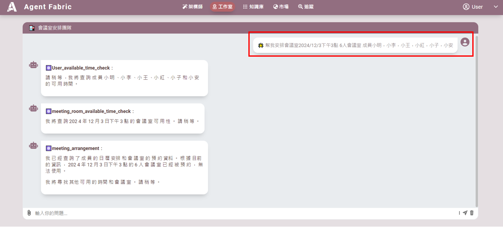

# 會議安排團隊
**會議安排團隊的主要目的是幫助辦公室有效地預約會議，節省時間，並減少線下協商場地的需求。透過自動化的流程，團隊能夠快速找到合適的會議時間和地點，提升工作效率。

「User_available_time_check Agent」會使用api tools-/user_info，查詢使用者提到的人員的時間表。「meeting_room_available_time_check Agent」會使用api tools-/room_info，查詢使用者提到的時間區間的會議室狀況。「meeting_arrangement Agent」，當收到人員的calendar安排時間，找到空閒的時間(沒有標示在calendar上的時段)；針對使用者空閒的時間，確認會議室的預約資料是否有空；提供三個時段及對應的會議室，符合:所有人員時間表有空閒且會議室有空的時段。**

此Agents掛載一個行事曆查詢的API工具，文件參考如下:
[OpenAPI JSON 文件](https://fake-meeting-room.datafabric.iii-ei-stack.com/openapi.json)

## 操作指導

1. **點選紅框編輯**

2. **點選筆的符號**

3. **編輯第一個代理 (Agent)**

   - **名稱**: `User_available_time_check`
   - **描述**: 你非常會使用 API tools 回復使用者問題。
   - **任務**: 使用 API tools 查詢使用者提到的人員的時間表。
   - **操作**:
     1. 編輯名稱、描述和任務。
     2. 選擇工具並加入 `#fake_demo./user_info`，新增請參考API工具使用指南。
     3. 按「送出」並儲存。

4. **編輯第二個代理 (Agent)**

   - **名稱**: `meeting_room_available_time_check`
   - **描述**: 你非常會使用 API tools 回復使用者問題。
   - **任務**: 使用 API tools 查詢使用者提到的時間區間的會議室狀況。
   - **操作**:
     1. 編輯名稱、描述和任務。
     2. 選擇工具並加入 `#fake_demo./room_info`，新增請參考API工具使用指南。
     3. 按「送出」並儲存。

5. **編輯第三個代理 (Agent)**

   - **名稱**: `meeting_arrangement`
   - **描述**: 你會評估人員的日曆安排時間，搭配會議室的預約資料，提供會議時間建議給使用者。
   - **任務**: 收到人員的日曆安排時間後﹑找到空閒時間（未標示在日曆上的時段）、確認會議室預約資料是否有空、提供三個時段及對應的會議室，需符合所有人員和會議室的空閒條件。
   - **操作**:
     1. 編輯名稱、描述和任務。
     2. 按「送出」並儲存。

6. **使用操作**
   - 點選「會議安排團隊工作室」。
   - 輸入會議人員、日期等信息以產出結果。
