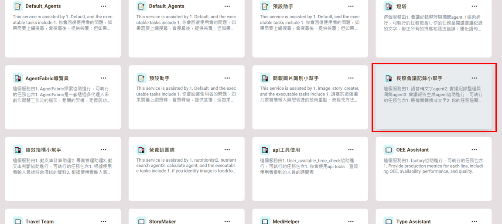
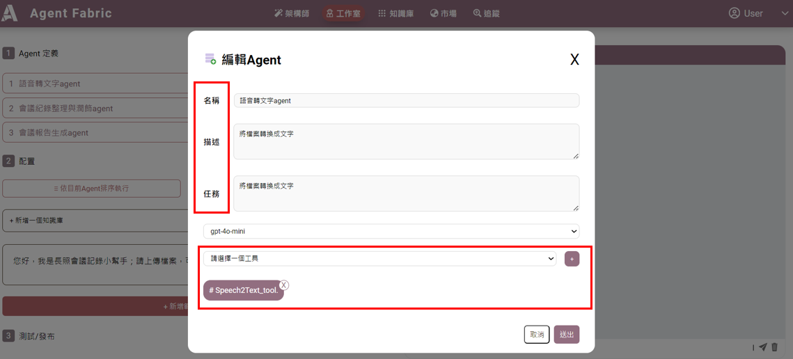
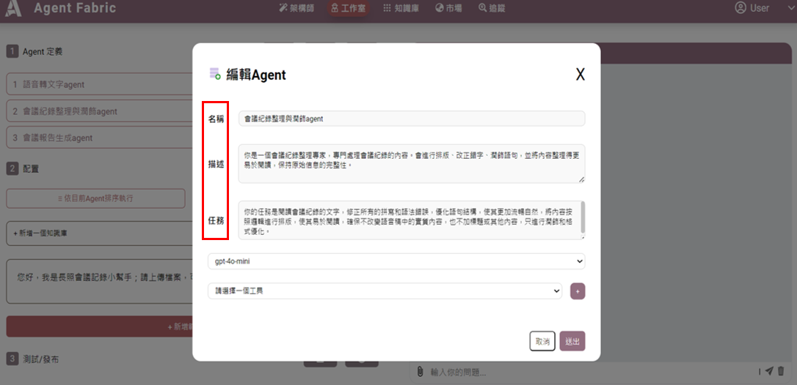
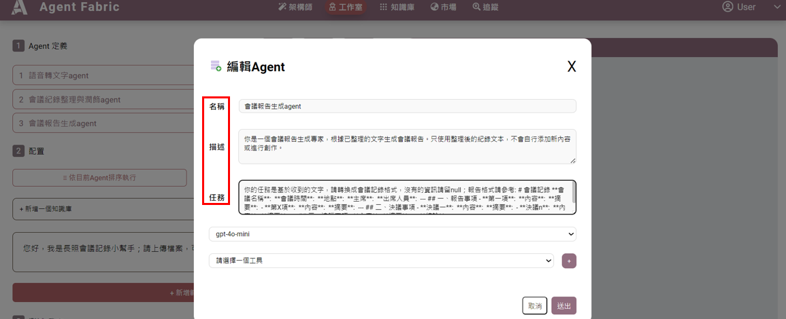
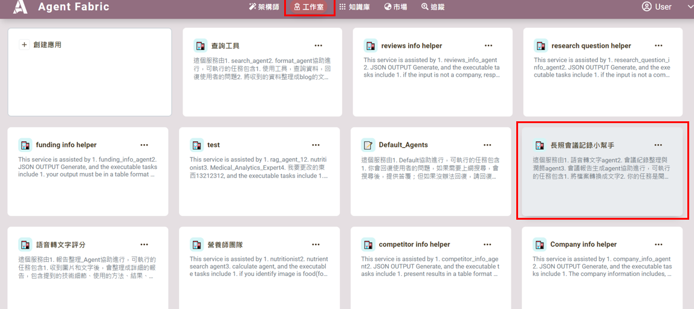
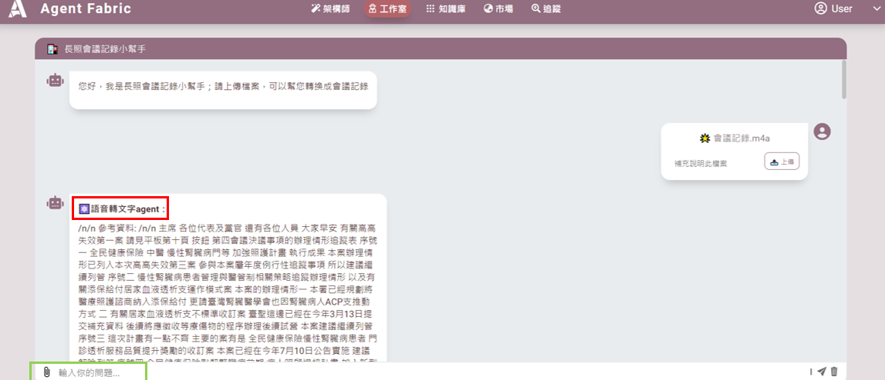
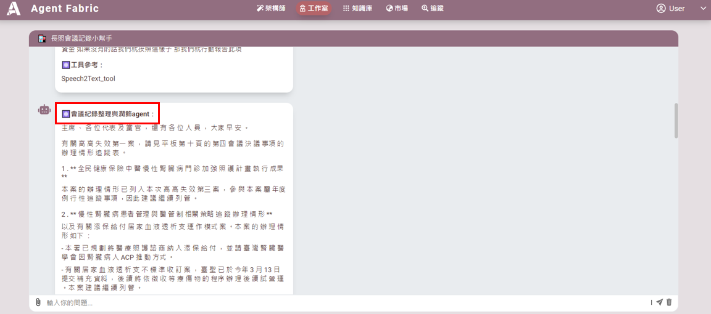

# 語音轉文字_會議記錄小幫手
---
**語音轉文字會議記錄小幫手，是一款專為學生班會和企業會議設計的工具，能夠將語音檔快速轉換為文字，方便用戶整理會議內容。這款小幫手特別適合需要準確會議紀錄的人士使用，但由於轉錄的準確性可能受到環境和語音質量的影響，因此建議用戶在使用前設定以下三個代理:「語音轉文字 Agent」-將音檔轉成文字稿，「會議記錄整理與潤飾 Agent」-修正文字內容，「會議報告生成 Agent」-進行文章摘要。**

# 創建步驟請參考，範例_長照法規AGENT
---
## 語音轉文字編輯
---
## A. 開啟會議記錄小幫手
1. 進入 **工作室**，選擇「會議記錄小幫手」。

---

## B. 配置「語音轉文字 Agent」
在 **標題 1「語音轉文字 Agent」** 中進行以下配置：
- **名稱**: 語音轉文字 Agent  
- **描述**: 將檔案轉換成文字。  
- **任務**: 將檔案轉換成文字。  
- **選擇工具**: 使用 `Speech2Text_tool`。

---

## C. 配置「會議記錄整理與潤飾 Agent」
在 **標題 2「會議記錄整理與潤飾 Agent」** 中進行以下配置：
- **名稱**: 會議記錄整理與潤飾 Agent  
- **描述**:  
  你是一個會議記錄整理專家，專門處理會議記錄內容。你會進行排版、改正錯字、潤飾語句，並將內容整理得更易於閱讀，同時保持原始信息的完整性。
- **任務**:  
  1. 閱讀會議記錄的文字。  
  2. 修正拼寫和語法錯誤，優化語句結構。  
  3. 排版內容，確保條理清晰，便於閱讀。  
  4. 確保不改變實質內容，也不添加標題或其他新內容。

---

## D. 配置「會議報告生成 Agent」
在 **標題 3「會議報告生成 Agent」** 中進行以下配置：
- **名稱**: 會議報告生成 Agent  
- **描述**:  
  你是一個會議報告生成專家，負責根據已整理的文字生成會議報告。  
- **任務**:  
  1. 使用整理後的紀錄文本，不自行添加新內容或進行創作。  
  2. 基於收到的文字，轉換成以下格式的會議記錄：
  ```markdown
  # 會議記錄
  **會議名稱**:  
  **會議時間**:  
  **地點**:  
  **主席**:  
  **出席人員**:  
  ---
  ## 一、報告事項
  - **第一項**:  
    **內容**:  
    **摘要**:  
  - **第 X 項**:  
    **內容**:  
    **摘要**:  
  ---
  ## 二、決議事項
  - **決議一**:  
    **內容**:  
    **摘要**:  
  - **決議 n**:  
    **內容**:  
    **摘要**:  
  ---
  ## 三、追蹤事項
  - **內容**:  
    **摘要**:  
  ---
  **結論**:

## E. 在 工作室 中，點選「會議記錄小幫手」。

## F. 將會議語音檔案上傳至綠色框中。填寫備註，說明會議記錄內容。

## G. 上圖和下圖的紅色框中將顯示整理後的會議記錄結果。
