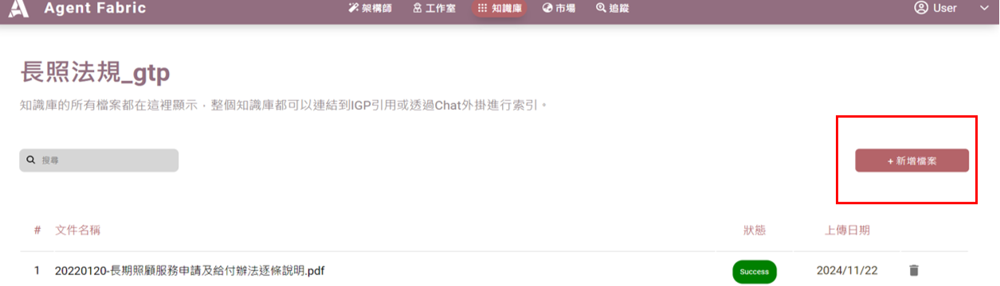
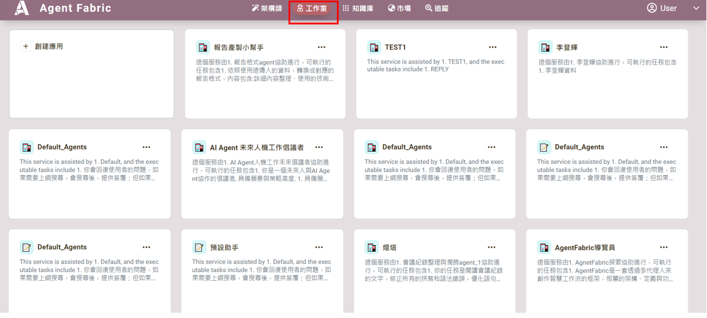
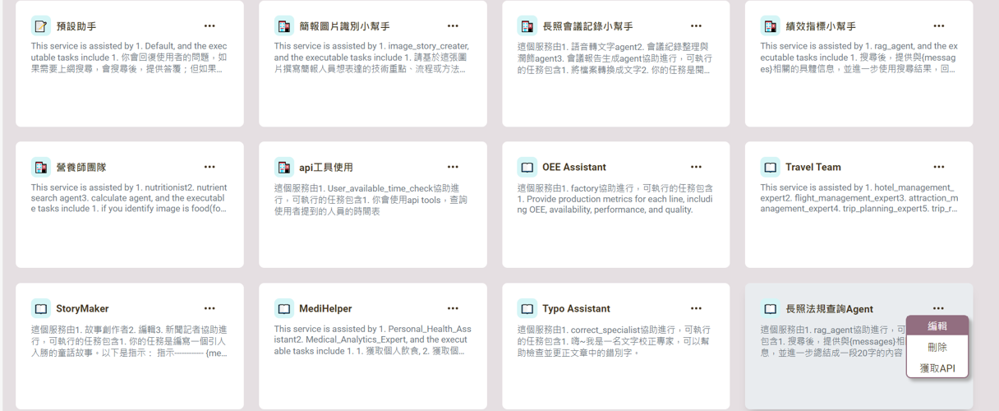
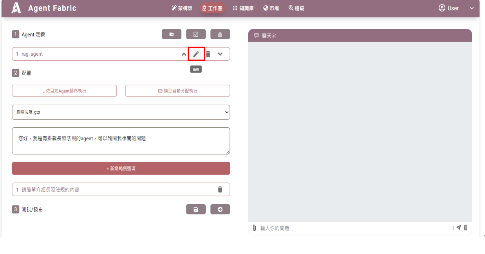
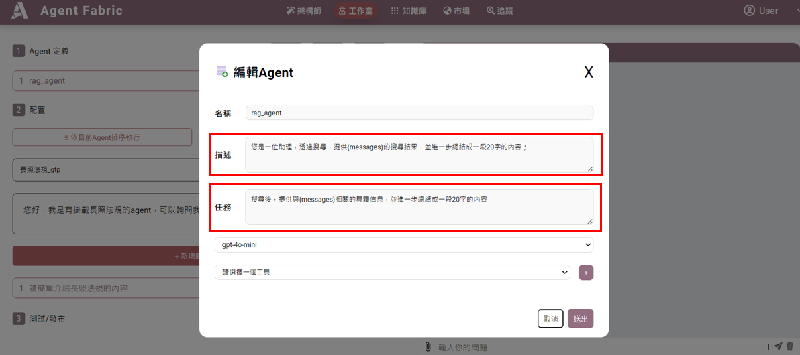
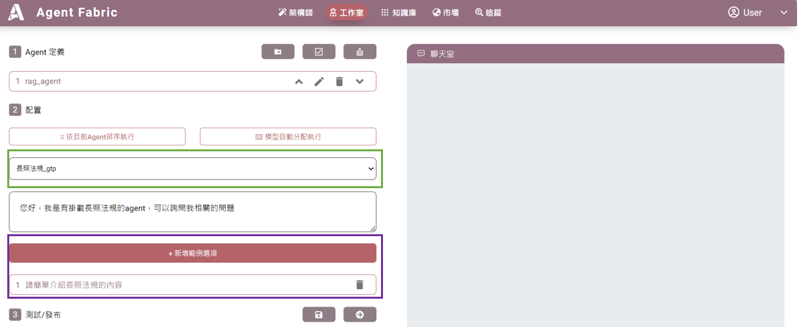
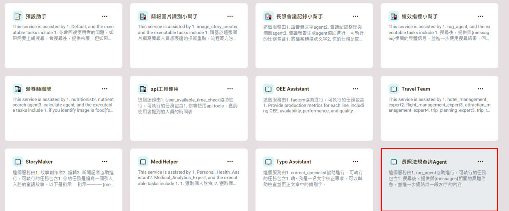

## 範例_長照法規 AGENT 的創建

**長照AGENT平台是一個專為政府及長期照護機構設計的資訊服務平台，旨在提供最新的長期照護法規資訊。透過這個平台，使用者可以輕鬆獲取與長照相關的法律條文、政策解讀及實務指導，協助政府及機構部門更有效地遵循法規，提升服務品質。長照AGENT致力於促進長期照護領域的透明度與專業性，成為各界在長照法規方面的可靠夥伴。**

---

## 1. 進入系統後，首先點選 **知識庫** 功能。

---

## 2. 在知識庫內新增資料夾根據需求，創建一個新的資料夾，用於存放相關數據。

---

## 3. 切換至 **工作室** 模組。

---

## 4. 創建請參考工作室。**描述** 和 **任務**請參考第六項。

---

## 5. 編輯請繼續往下。

---

## 6. 在 **描述** 和 **任務** 欄位內，填入需要的指令內容。

---

## 7.  在**綠色框**選擇**長照法規資料庫**。在**紫色框**設定新增的範例問題。

---

## 8. 回到工作室內，選擇 **長照法規**。

---

## 9. 選擇已設定的範例問題、或是直接打字提問，即可獲取相關資訊。

