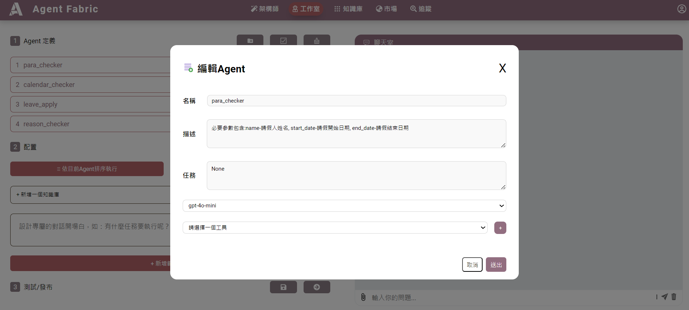

# 確認參數設定
讓Agent確認使用者是否有輸入必要參數，確認後才會往下進行。

## 設定方法

1. agent名稱**一定要**叫**para_checker**
2. 描述的寫法: "必要參數包含:" + {參數名稱} 及 {參數說明};
    例:必要參數包含:name-請假人姓名, start_date-請假開始日期, end_date-請假結束日期
3. 其他agent可以依照各自的業務邏輯進行安排
