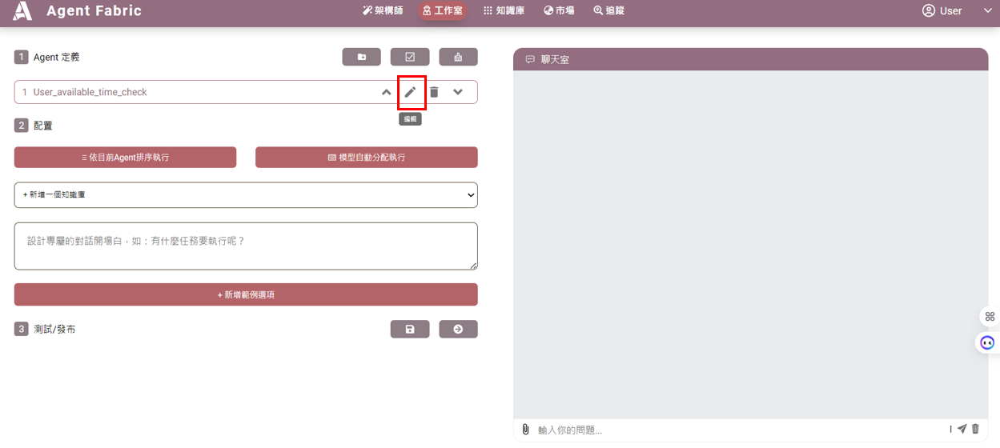
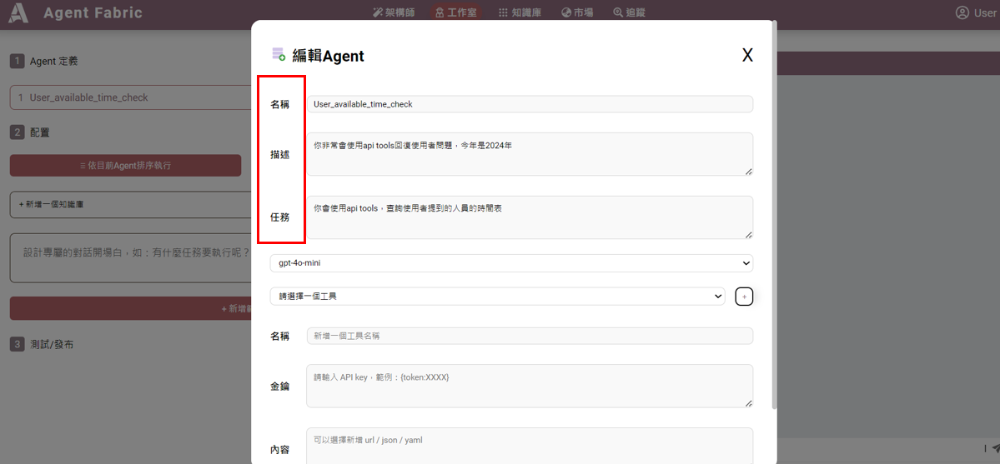
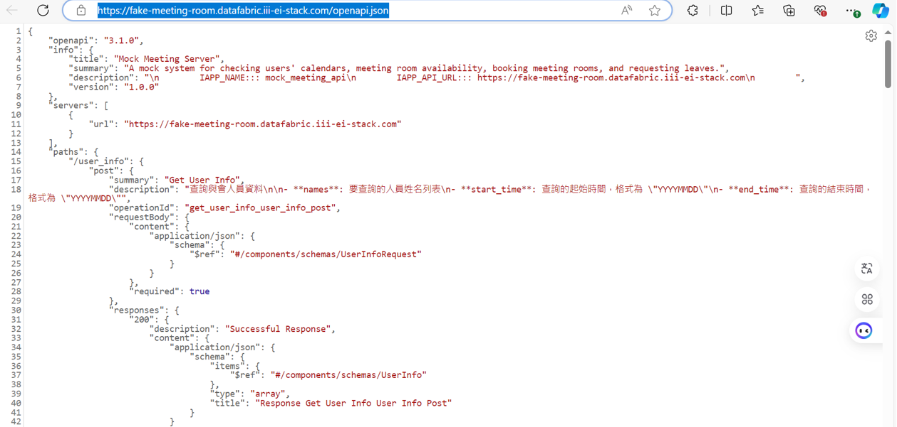
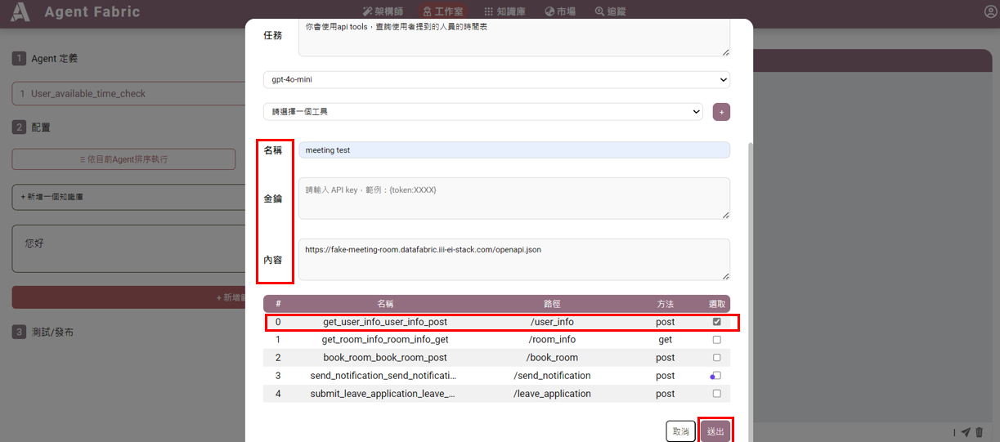
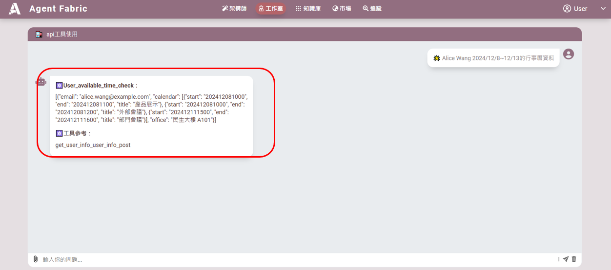
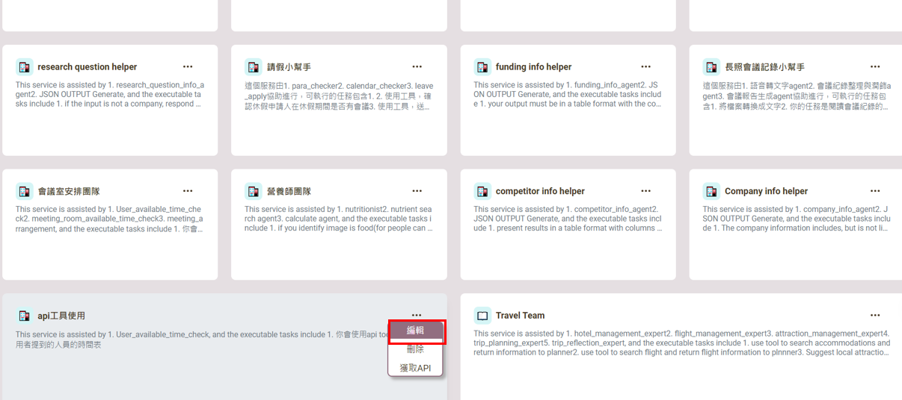
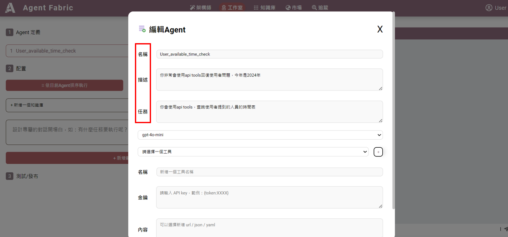
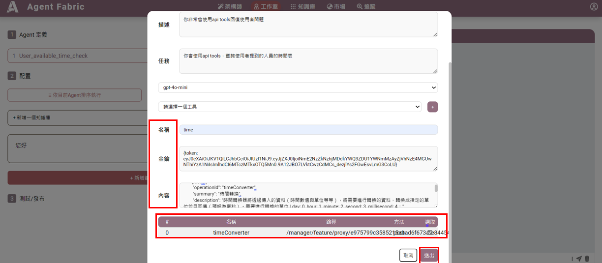
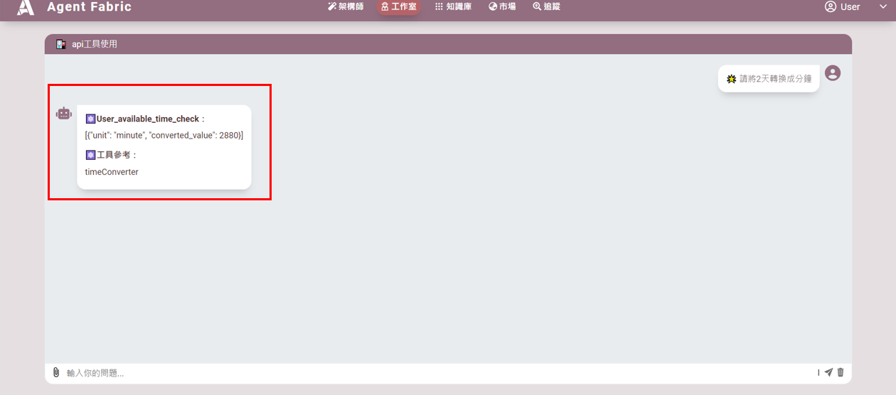

# API 工具使用指南
此API工具支援有金鑰和無金鑰的API串接

## 無金鑰操作流程

1. 點選 API 工具使用的編輯。

2. 點選筆的符號。

3. 編輯紅框中的Agent名稱、描述、任務：
   - **名稱**：`User_available_time_check`
   - **描述**：你非常會使用 API tools 回復使用者問題。今年是 2024 年，你會使用 API tools。
   - **任務**：查詢使用者提到的人員的時間表。
   
  
   
4. 這個Agent是要掛載一個行事曆查詢的API工具，此API無須授權認證，
API文件參考如下:
[OpenAPI JSON 文件](https://fake-meeting-room.datafabric.iii-ei-stack.com/openapi.json)
   
工具新增方式: 
點選 `+新增工具`：
   - **名稱**：工具名稱，可以自行填寫
   - **金鑰**：不用認證，不用填
   - **內容**：支援json，url，yaml
   - 勾選藍色框的列表，按送出。
   - 儲存
    
5. 測試 API 功能，輸入指令「Alice Wang 2024/12/8~12/13 的行事曆資料」，即可驗證結果。
 
---

## 有金鑰操作流程

1. 點選 API 工具使用的編輯。
 
2. 點選筆的符號。
 
3. 編輯紅框中的Agent名稱、描述、任務：
   - **名稱**：`User_available_time_check`
   - **描述**：你非常會使用 API tools 回復使用者問題。今年是 2024 年，你會使用 API tools。
   - **任務**：查詢使用者提到的人員的時間表。
    
4. 這個Agent是要掛載一個時間單位轉換的API工具，此API須授權認證，
工具新增方式: 
點選 `+新增工具`，並輸入以下內容：
   - **名稱**：工具名稱，可以自行填寫
   - **金鑰**：`{token: eyJ0eXAiOiJK...}`
   - **內容**：支援json，url，yaml，[下載 JSON 配置文件](./example_data/openapi_tool_example.json)
   - 選紅色框的列表，按送出。
   - 儲存
    
5. 測試 API 功能，輸入指令「請將 2 天轉換成分鐘」，紅框為驗證輸出的結果。
 