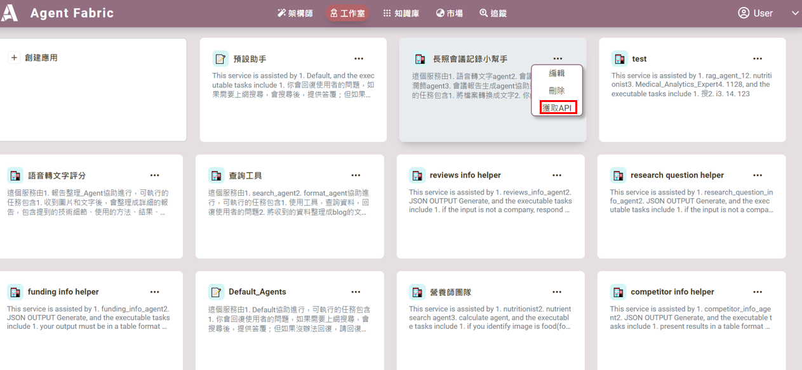
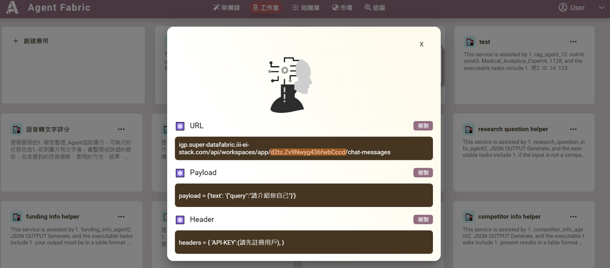

# 工作室串接


提供 RESTful API 接口進行工作室和其他服務串接：

---

## 步驟說明

### 1. 獲取 API
- 進入 **工作室**。
- 點擊三個點選項，獲取 API。


---

### 2. 確認 API 的 URL
- 在橘色方框中可以找到 ID的位置。


### 3. 可以使用restful API的格式請求服務:
```python
import requests

url = "https://{host}/api/workspaces/apps/{id}/chat-messages"

payload = {'session': 'xxxxxxxx',
'text': '請產生會議紀錄'}
files=[
  ('file',('會議記錄.mp3',open('會議記錄.mp3','rb'),'audio/mpeg'))
]
headers = {
  'API-KEY': 'xxxxxxx'  
}

response = requests.request("POST", url, headers=headers, data=payload, files=files)

print(response.text)

```
##### 工具註解

| 參數          | 說明                                                                                         |
|---------------|----------------------------------------------------------------------------------------------|
| **session**   | 同一次對話的 `uuid`，類型為 `str`，非必填。                                                    |
| **text**      | 要求服務執行的內容。如果 `file` 中有資料，可以不用填寫。例如：「請幫我整理會議記錄」。              |
| **file**      | 要請服務處理的檔案，目前支援格式：`mp3`、`pdf`、`jpg`、`png`。                                    |
| **API-KEY**   | 需向 AgentFabric 管理員申請 ID。                           
